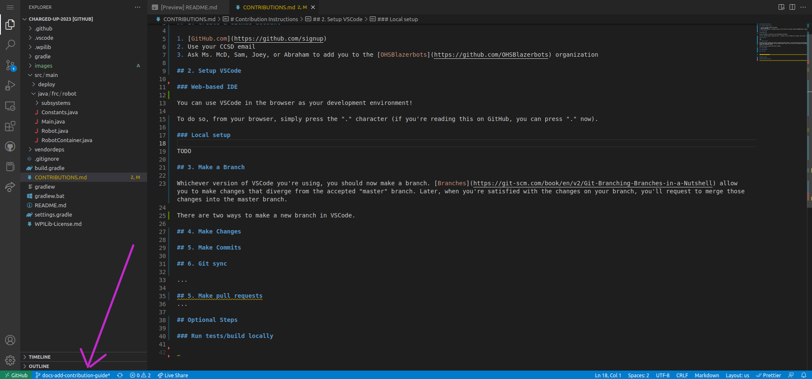
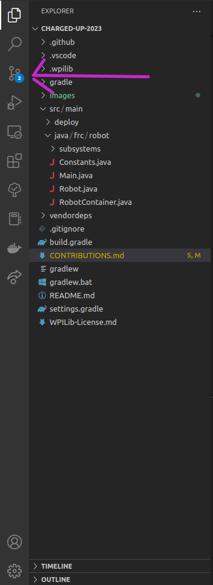
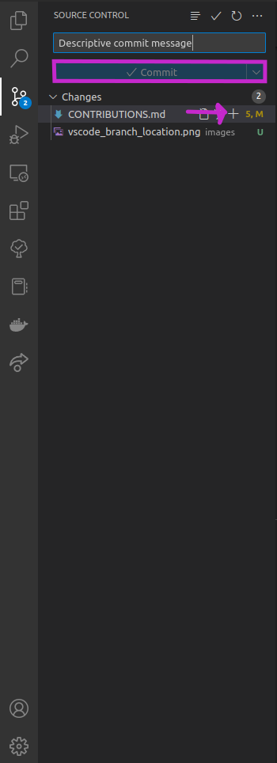

# Contribution Instructions

## 1. Create a GitHub account

1. [GitHub.com](https://github.com/signup)
2. Use your CCSD email
3. Ask Ms. McD, Sam, Joey, or Abraham to add you to the [OHSBlazerbots](https://github.com/OHSBlazerbots) organization

## 2. Setup VSCode

### Web-based IDE

You can use VSCode in the browser as your development environment!

To do so, from your browser, simply press the "." character (if you're reading this on GitHub, you can press "." now).

### Local setup

TODO

## 3. Make a Branch

Whichever version of VSCode you're using, you should now make a branch. [Branches](https://git-scm.com/book/en/v2/Git-Branching-Branches-in-a-Nutshell) allow you to make changes that diverge from the accepted "master" branch. Later, when you're satisfied with the changes on your branch, you'll request to merge those changes into the master branch.

To view the branch that you are currently editing, look at the lower left of VSCode:

To create a new branch, click on the name of the current branch. In the dialog that pops up, enter the name you wish to give your new branch and select "Create new branch". Make sure to give your branch a meaningful name. There are numerous naming schemes out there, but for our purposes something as simple (and straightforward) as `elevator-subsystem` should suffice.

## 4. Make Changes

Now that you've created a branch for your work, you can make the changes you need to make. General guidelines to follow:

1. Don't modify [Main.java](src/main/java/frc/robot/Main.java) or [Robot.java](src/main/java/frc/robot/Robot.java) unless you really need to
2. Define subsystems in [subsystems/](src/main/java/frc/robot/subsystems/)
3. Initialize subsystems in [RobotContainer.java](src/main/java/frc/robot/RobotContainer.java)
4. Link subsystems to controllers in [RobotContainer.java](src/main/java/frc/robot/RobotContainer.java)
5. Define constants (CAN IDs, PID constants, PWM ports, etc.) in [Constants.java](src/main/java/frc/robot/Constants.java)

## 5. Make Commits

When you've reached a good stopping point with your changes, make sure to commit them. A [commit](https://github.com/git-guides/git-commit) is a snapshot of the repository. If you ever need to go back in time, commits allow you to do that. General guidelines are to commit often, use descriptive commit messages, and make small, single topic commits.

To make a commit from VSCode, open the source control panel:

Enter a descriptive commit message and stage the changes:

Press the `+` button for each file you would like to commit. Tip: you can (and should) click on each file in the commit menu to review the changes you're making before committing them.

## 6. Git sync

Once you've made the commit, you should sync it to GitHub. In the source control panel click 'Publish Branch' (if this is a new branch) or 'Sync Changes' (if you've already published the branch). You should do this frequently (ideally after every commit, even if you're not ready) so that others can view your changes and to back up your changes in case something happens to your copy of the repository.

## 7. Make pull requests

Once you'd like to merge your changes into master, open a pull request (PR). GitHub can describe this better, so follow the instructions for this here: <https://github.com/skills/introduction-to-github#step-3-open-a-pull-request>.

Opening the pull request will check that the robot code still compiles with your changes and allow other team members to review your code. It will need to be reviewed by at least one other member of the team before it can be merged into the master branch.

You don't need to make all of the changes you want to make before opening a PR. If fact, if you can't compile the code locally, opening a PR and using that for basic testing is a good way to do that. You can repeat steps 4-6 as many times as needed before merging.

After a PR is merged, delete the branch that you used and start again at step 3 for your next feature!

## Optional Steps

### Run tests/build locally

TODO

### Useful reading on Git

* [The Git Book](https://git-scm.com/book/en/v2)
* [GitHub Git Guides](https://github.com/git-guides/)
* [Introduction to GitHub](https://github.com/skills/introduction-to-github)

## Confirmations

* This is my confirmation that I have read and understand the contributions. - Yathaarth
* I've read & understand this document, thank you! - Younes
